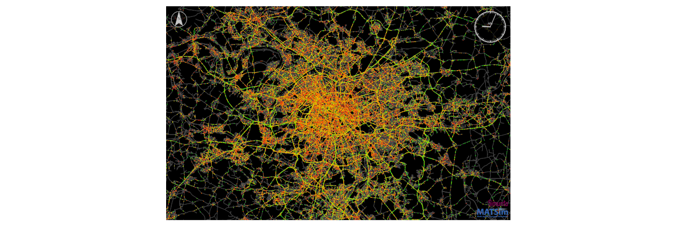

# An open synthetic population of Île-de-France

This repository contains the code to create an open data synthetic population
of the Île-de-France region around in Paris and other regions in France.

## Main reference

The main research reference for the synthetic population of Île-de-France is:
> Hörl, S. and M. Balac (2021) [Synthetic population and travel demand for Paris and Île-de-France based on open and publicly available data](https://www.sciencedirect.com/science/article/pii/S0968090X21003016), _Transportation Research Part C_, **130**, 103291.

## What is this?

This repository contains the code to create an open data synthetic population
of the Île-de-France region around in Paris and other regions in France.
It takes as input several publicly
available data sources to create a data set that closely represents the
socio-demographic attributes of persons and households in the region, as well
as their daily mobility patterns. Those mobility patterns consist of activities
which are performed at certain locations (like work, education, shopping, ...)
and which are connected by trips with a certain mode of transport. It is known
when and where these activities happen.

Such a synthetic population is useful for many research and planning applications.
Most notably, such a synthetic population serves as input to agent-based
**transport simulations**, which simulate the daily mobility behaviour of people
on a spatially and temporally detailed scale. Moreover, such data has been used
to study the **spreading of diseases**, or the **placement of services** and facilities.

The synthetic population for Île-de-France can be generated from scratch by
everybody who has basic knowledge in using Python. Detailed instructions
on how to generate a synthetic population with this repository are available below.

Although the synthetic population is independent of the downstream application
or simulation tool, we provide the means to create an input population for the
agent- and activity-based transport simulation framework [MATSim](https://matsim.org/).

This pipeline has been adapted to many other regions and cities around the world
and is under constant development. It is released under the GPL license, so feel free
to make adaptations, contributions or forks as long as you keep your code open
as well!

## Documentation

This pipeline fulfils to purposes: First, to create synthetic populations
of French regions in *CSV* and *GLPK* format including households, persons
and their daily localized activities. Second, the pipeline makes use of
infrastructure data to generate the inputs to agent-based transport simulations.
These steps are described in the following documents:

- [How to create a synthetic population of Île-de-France](docs/population.md)
- [How to run a MATSim simulation of Île-de-France](docs/simulation.md)

Furthermore, we provide documentation on how to make use of the code to create
popuations and run simulations of other places in France. While these are
examples, the code can be adapted to any other scenarios as well:

- [Toulouse and Occitanie region](docs/cases/toulouse.md)
- [Lyon and neighboring departments](docs/cases/lyon.md)
- [Nantes and Loire Atlantique](docs/cases/nantes.md)
- [Corsica](docs/cases/corsica.md)

## Publications

- Hörl, S. and M. Balac (2021) [Synthetic population and travel demand for Paris and Île-de-France based on open and publicly available data](https://www.sciencedirect.com/science/article/pii/S0968090X21003016), _Transportation Research Part C_, **130**, 103291.
- Hörl, S. and M. Balac (2021) [Open synthetic travel demand for Paris and Île-de-France: Inputs and output data](https://www.sciencedirect.com/science/article/pii/S2352340921008970), _Data in Brief_, 107622.
- Hörl, S., M. Balac and K.W. Axhausen (2019) [Dynamic demand estimation for an AMoD system in Paris](https://ieeexplore.ieee.org/document/8814051),
paper presented at the 30th IEEE Intelligent Vehicles Symposium, Paris, June 2019.
- Hörl, S. (2019) [An agent-based model of Île-de-France: Overview and first results](https://slides.com/sebastianhorl/matsim-paris), presentation at Institut Paris Region, September 2019.

## Versioning

The current version of the pipeline is `v1.2.0`. You can obtain it by cloning
the `v1.2.0` tag of this repository. Alternatively, you can also clone the
`develop` branch to make use of the latest developments. The version number
will be kept in the `develop` branch until a new version is officially released.

Note that whenever you create a population with this pipeline, the `meta.json`
in the output will let you know the exact `git` commit with which the
population was created.
