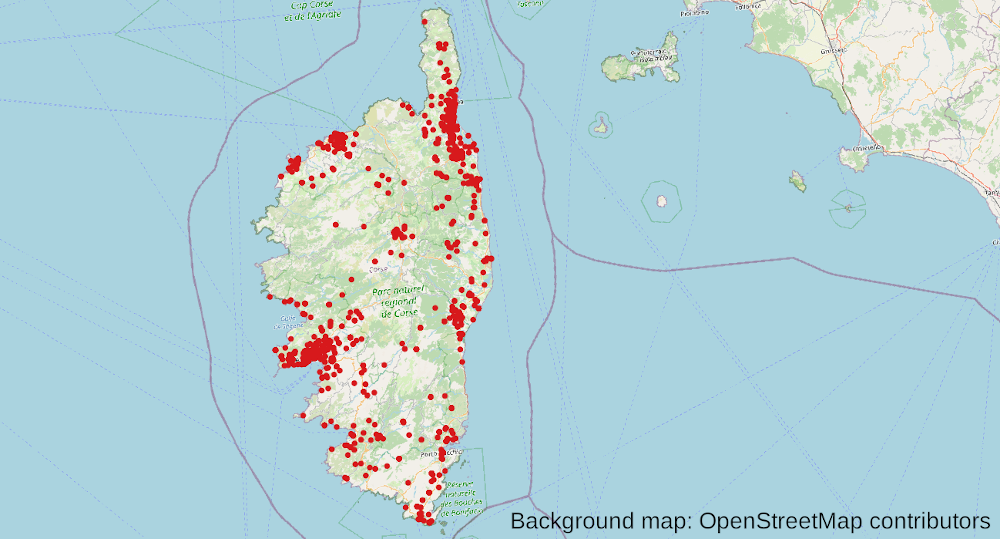

# How to create scenarios of other regions in France

To create scenarios for other regions, the pipeline contains additional
functionality. However, we always recommend to first start with the
[Île-de-France scenario](howto.md) as it shows the basic installation
steps and described most of the data that needs to be gathered. Only some
of the required data sets are specific to a certain region and hence will
be reused here. We furthermore rely on the directory structure that is
introduced for the [Île-de-France scenario](howto.md).

## Corsica



A good example for creating a small, useable synthetic population for another
region is Corsica. Only few adjustments need to be added to the configuration
file and additional data sets need to be provided.

Corsica is not included in the census data set that is used for
[Île-de-France](howto.md) (*Zone A*). Instead, the *dbase* version of
*Zone E* needs to be downloaded from the [same source](https://www.insee.fr/fr/statistiques/362522).
The downloaded file *FD_INDCVIZE_2015.dbf* should be put next to the file
for Île-de-France (or instead of it) into the `rp_2015` data folder.

Clearly, Corsica can only be generated using the *ENTD* as the household travel
survey, so you should make sure that the configuration file contains `hts: entd`.
Afterwards, three configuration options that otherwise carry default values for
Île-de-France need to be added:

```yaml
regions: [94]
census_path: rp_2015/FD_INDCVIZE_2015.dbf
matching_minimum_observations: 5
```

The first option is a filter that describes for which regions the scenario
should be created. The user needs to make sure that the required data is
provided correctly. Here, we filter for region `94`, which is Corsica. In the
second line, we override the default path to the census data. Note the change
of the character *A* to *E* as we are now using the census data for *Zone E*.
Finally, we lower the limit for the statistical matching stage in the pipeline
to a minimum of five matching observations as there is only little data
available for Corsica (in fact, in total the ENTD only contains about 40
observations).

Clearly, for an advanced use case, one would need to obtain better data and
potentially adjust the pipeline more specifically to make use of it, or maybe
fall back to the entire ENTD as a second-best option. However, this is only a
basic example to show how to create a synthetic population for another region.

The `synthesis.output` stage can now be run as previously and a scenario for Corsica
will be generated.

Note that this does not involve the simulation yet. To perform the MATSim
simulation, additional data is needed: OpenStreetMap and GTFS. Geofabrik
provides a Corsica cut-out [here](http://download.geofabrik.de/europe/france/corse.html)
and the procedure for making the data useable by the pipeline is the same
as for [Île-de-France](howto.md). To make use of the resulting file, the
coniguration needs to be adjusted (as for the census before) with:

```yaml
osm_path: osm/corse-latest.osm.gz
```

For Corsica, two GTFS schedules are available, one for [trains](https://www.data.gouv.fr/fr/datasets/donnees-gtfs-transport-trains-des-chemins-de-fer-corse-horaires/) and one for
[busses](https://www.data.gouv.fr/fr/datasets/donnees-gtfs-transport-cars-de-haute-corse/). We haven't found a straight-forward way to combine them without additional
steps of cleaning, so for the sake of brevity, we will only work with the
ones for trains in this example. Download the *zip* file an unpack it either
to data `your_data/gtfs` folder, or in another one next to it. You can specify
the location of the `gtfs` folder to the pipeline using the configuration
file:

```yaml
osm_path: corsica_gtfs
```

Finally, you should now be able to run the `matsim.output` stage and perform
a simulation for Corsica.
